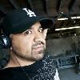
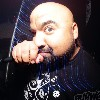
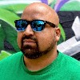
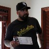
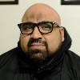
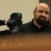
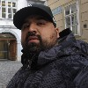

For an HTML version, check [here](https://cowglow.github.io/presenter-terms/)

# Philip Saa speaking terms

Hello I am Philip and I am happy that you are interested in me speaking at your event. I forked Christian Heilmann's [presenter terms](https://github.com/codepo8/presenter-terms) to base my own terms. While my experience might be limited, I will treat speaking at your event with the utmost respect and professionalism. Therefore I want to make sure that there is no misconception about what I expect and deliver.

## Personal information

* **Name:** Philip Saa
* **Company:** [compose.us GmbH](https://compose.us/)
* **Job Title:** Programmer
* **Twitter:** [@cowglow](https://twitter.com/cowglow)
* **Homepage:** [cowglow.com](https://cowglow.com)
* **Location:** Meckenhausen, Germany

## Presenter Bio

> Philip Saa is an American living and working in Germany. His interest range from film making to music theory and has experience in a variety of creative multimedia disciplines. He moved to Germany to work for Raythoen IIS where his responsibilities included producing video products and programming the [Simtelink Platform](https://www.dvidshub.net/video/385954/simtelink-capability). He is currently programming for compose.us GmbH, a distributed start-up focusing on digital automation solutions for medium to large companies in Germany and Austria. From time to time he also also publishes Instagram Stories and short video projects on his YouTube Channel.

## I am available for... 

- [x] Keynotes 
- [x] Talks
- [x] Workshops
- [x] Panels
- [x] Moderation / MC Duties
- [x] Video series

## Subjects I cover... 

- [x] Film/Video Production 
- [x] Web development - JavaScript
- [x] Social media - Content and strategies
- [x] Leadership - Decision making
- [x] Diversity
- [x] Personal Finances 
- [x] Buddhism

## Show stoppers

I know it is hard to organise events, so I want to make sure that we are on the same level. Here is a list of things 
that I consider "Deal-breakers." 

* [x] Your event does not have a code of conduct.
* [x] And unless it's a local event in the Nürnberg area, I'm not willing to pay for my own travel/lodging expenses.

## My deliveries at your event

Here's what I will do when invited as a presenter at your event.

- [x] **Deliver a talk fitting talk for the intended audience, on time and sticking to the defined format and duration.** 
  - I want to know what time frame I am expected to present and what format you would like it to be in.
  - I will show up at the times you need me to be there and with with your AV personnel to ensure the equipment is functional. 
- [x] **Be available for event attendees.** 
  - Whether it's for networking, answering questions, providing feedback or simply sharing my experience, 
  - I am more than glad to make myself available for your attendees.
- [x] **Be available for other promotional parts of the event.** 
  - I am happy to do interviews, press or other related activities to help you promote your event.
  - I'll re-tweet, re-post and share.
- [x] **Share my slides and give full-release of any photography or video recordings.**
  - If there is a good enough connection, this normally happens right after the presentation.
  - Everything I create at your event will be licensed Creative Commons unless otherwise agreed. 

## My setup 

I am pretty open to different ways of presenting, but here is my preferred setup

- [x] I like to use my own computer with an HDMI connection. (I will provide the correct dongle, if necessary)
- [x] I would prefer to use a remote clicker and have a monitor where I can see my slides instead of having to refer to the screen behind me.

If I need to use a central computer instead of mine, please consider that it will limit the ability to do a "live coding/editing" demo.

## My expectations

I expect to be treated as a professional, and as I will do my part to ensure that your event will be a success, I also expect you to carry yourself accordingly.
Communication among parties is key, so please ensure you provide the following:

- [ ] **Provide me with a specific or precise speaking slot.** 
- [ ] **Deliver a professional stage setup.**
- [ ] **Professional quality A/V recording.** 
- [ ] **Keep me out of sponsorship discussions.**

## Things can go wrong... 

Even with the best intentions, there may be trouble and I might not be available for your event. You may also change your mind. If that happens, here's what I want to happen.

- [x] When I can not attend for some reason or another, I will communicate it as-soon-as-possible.
- [x] I can assist you in finding a replacement presenter or alternative solution.
- [x] When for some reason you decide to slash my speaking slot, I expect you to cover the cost involved for me.

## Presenter Head shots 

 
 

## &copy; Photo licenses and information:

* Necessary Measures (Boom Operator): [Rogue Division](https://www.roguedivision.tv)
* MC Scrpt (Club Nano): [Zoltan Puskely](https://www.facebook.com/zolip)
* DubWorXx Crew (Gostenhof): [Zoltan Puskely](https://www.facebook.com/zolip) 
* Husband &amp; Wife Series (1st AD): [Ethan Benjamin](https://twitter.com/NerdiblesShow) 
* Radio Z (Nürnberg): [Alex Cio](https://twitter.com/alexcio_)
* Raython IIS (JMRC Hohenfels): Multimedia Center
* Blutgasse (Vienna): Self Portrait
